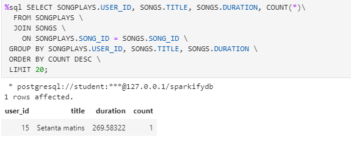

# DATA MODELLING WITH POSTGRES

Data modelling with postgres, is to get an understanding of modelling database to load fact and dimension tables to cheive normalization and eliminating duplicate data. 

To achieve this, we have utilized the million song  dataset with song data and log data and designed our data strucures in a simple star schema. We have database sparkifyDB with **1 fact table** and **4 dimension tables**. The project also serves to help understand working with big data set in various formats, in this case json files, on how to identify the records needed for the tables, the format of the records in the files and  to load specific columns from the source to target tables.

The data can be used by a start up analytical compnay to generate playlist of the users based on 
1. Gender of the users.
2. Duration of the songs and understand if a specific duration of songs are preferred and help improve playlist selection/suggestion.
3. Artist preferences or artists from a certain location
4. Log in activity of the user, do they log in a specific hour of the day daily or weekly, and what song was preferred on the previous log in.
5. help prevent multiple log in from difference machines by tracking the user agent and checking if the user has already logged in from a different machine.

The data has been stored in a way the makes analysing this data set can be done in fewer joins keeping above points in mind.

## STAR SCHEMA

The project has been implmented in **star schema**. since this gives the best possiblity to reduce duplicity of the data and the dimensions are identified based on what the reporting is going to utilize most often. below are the data model of the indivdual tables being utilzzed.

#### Fact table - songplays

| ATTRIBUTE   | DATA TYPE | CONSTRAINT  | DEFAULT VALUE |
|-------------|-----------|-------------|---------------|
| SONGPLAY_ID | SERIAL    |             |               |
| START_TIME  | TIMESTAMP | PRIMARY KEY |               |
| USER_ID     | INT       | PRIMARY KEY |               |
| LEVEL       | VARCHAR   |             |               |
| SONG_ID     | VARCHAR   | PRIMARY KEY |               |
| ARTIST_ID   | VARCHAR   | PRIMARY KEY |               |
| SESSION_ID  | INT       |             |               |
| LOCATION    | TEXT      |             |               |
| USER_AGENT  | TEXT      |             |               |

Has composite PK of user_id, song_id, Artist_id and start time to make sure there are no duplicate records in the table. also these id's will be used to join with the corresponding dimension tables.

#### Dimension table 

##### 1 - USERS

| ATTRIBUTE  | DATA TYPE | CONSTRAINT | DEFAULT VALUE |
|------------|-----------|------------|---------------|
| USER_ID    | INT       |            |               |
| FIRST_NAME | VARCHAR   |            |               |
| LAST_NAME  | VARCHAR   |            |               |
| GENDER     | VARCHAR   |            |               |
| LEVEL      | VARCHAR   |            |               |

This table contains all information about the user. where level is the paid/free member. to join with the fact table, join on the user_id column.

##### 2 - SONGS

| ATTRIBUTE | DATA TYPE | CONSTRAINT | DEFAULT VALUE |
|-----------|-----------|------------|---------------|
| SONG_ID   | VARCHAR   |            |               |
| TITLE     | VARCHAR   |            |               |
| ARTIST_ID | VARCHAR   |            |               |
| YEAR      | INT       |            |               |
| DURATION  | FLOAT     |            |               |

This table contains all information about the songs listened. To join with the fact table, join on the song_id column.

##### 3 - ARTISTS

| ATTRIBUTE | DATA TYPE | CONSTRAINT | DEFAULT VALUE |
|-----------|-----------|------------|---------------|
| ARTIST_ID | VARCHAR   |            |               |
| NAME      | VARCHAR   |            |               |
| LOCATION  | VARCHAR   |            |               |
| LATITUDE  | FLOAT     |            |               |
| LONGITUDE | FLOAT     |            |               |

This table contains all information about the artists. To join with the fact table, join on the artist_id column.

##### 4 - TIME

| ATTRIBUTE  | DATA TYPE | CONSTRAINT | DEFAULT VALUE |
|------------|-----------|------------|---------------|
| START_TIME | TIMESTAMP |            |               |
| HOUR       | INT       |            |               |
| DAY        | INT       |            |               |
| WEEK       | INT       |            |               |
| MONTH      | INT       |            |               |
| YEAR       | INT       |            |               |
| WEEKDAY    | VARCHAR   |            |               |

This table contains all time based data, tp help time base d analytics

## ETL Pipeline

To help load tables, we have the following files:
- sql_queries.py:

This python file has individual statements to drop, create and insert records to the fact and dimension tables. it also has query to extract song id and artist id for loading to the fact table - songplays.

- create_tables.py

This python script, imports create table and drop table lists from sql_queries.py and loops through the lists to drop and create the tables. The script first creates the sparkyfydb and creates a postgres cursor.

- data directory

This directory contains the song play and log files dataset to be used for processing

- etl.py

This is our master python script which sends the file names are parameters to the process data function which inturn calls rspective file process functions - songfile or log file. 
The process data function loops through respective directiries and creates a list of files to be processed, and then loops through the files in the list and calls either song file function which reads the json file and converts to a pands dataframe and loads the record with insert table list from the sql_queries file ato the corresponding table. 

The log file function is similar to the songs file process function, how ever, inorder to load the time table, the data in the log file is converted from ms to time stamp and stored in the pandas data frame. and then simalary the dimension tables - users and times are loaded using the insert statement from sql_queries file. 
for loading the fact table - songplays, since the song_id and artist_id are present in the song_data dataset, we get the respective information from the songs and artists table loaded in the earlier function based on the song title, artists name and song duration from the log file. and again loaded into the songplays table using the insert statement from the queries file.

The whole script has been designed to keep the whole data flow simple and the recursive parts are poved to their own functions. with a function to first create a list of files and then functions for processing the 2 files and the respective tables.

in order to help us with the building of the etl.py, we have below 2 jupyter notebooks:

   - etl.ipynb
   
   This notebook has all the variables utilized in the etl.py script, which serves as the practice for understadning what the variable contains, it also serves to understand the break down of the steps needed to build the final product. this can be seen as the building blocks and the steps needed utilizing only file at a time while the etl.py is the final product which reads the whole data set. to run the jupyter notebook however the database and the tables have to be created using the createe tables.py.
   
   - test.ipynb
   
   This jupyter notebook can be used to validate if the tables are created,  and records are inserted corectly andother analytical querieso n the data. the first fewcommands creates the connection to the sparkyfy database and creates cursor. 
   
#### Execution

To execute the python scripts, open a new terminal from the launcher windows and type - **python \<script name>**. below is the order of scripts to run

1. create_tables.py - to set up database and create the tables
2. etl.py - to load the data files to tables.

## Sample Data

1. 
2. 
